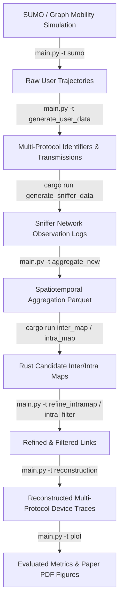

# 🏗️ CrossLink Architecture & Configuration Guide

This document provides a detailed technical overview of the system architecture, component modules, algorithmic workflow, and configuration options for **CrossLink**, a passive cross-protocol tracking framework linking temporary identifiers emitted across LTE, Wi-Fi, and BLE.

---

## 📐 System Pipeline Architecture

The end-to-end execution flow of CrossLink spans mobility trace parsing, multi-protocol transmission simulation, distributed sniffer observation modeling, high-performance Rust candidate graph construction, Python cross-protocol consistency refinement, trace trajectory reconstruction, and privacy assessment.



---

## 🗂️ Repository Structure

```text
.
├── configs/                 # Scenario configuration YAML files (32 to 512 users)
├── data/                    # User mobility traces, sniffer logs, and ground truth data
├── design/                  # Pipeline architectural diagrams (approach.png, code_pipeline.pdf)
├── output/                  # Reconstructed device traces and generated PDF vector figures
├── plot/                    # Plotting scripts for paper figures and evaluation charts
├── reconstruction/          # Single- and multi-protocol trace reconstruction algorithms
├── scenario/                # SUMO mobility spatial networks and OSM polygon bounds
├── simulation/              # SUMO and synthetic graph mobility generators
├── tracing_algorithm/       # Spatiotemporal link aggregation, refinement, & filtering
├── rust_code/               # High-performance Rust backend (sniffer logging, inter/intra mapping)
├── real_world/              # Empirical dataset & evaluation scripts for 12 commodity devices
├── main.py                  # CLI entry point for Python pipeline stages
├── pipeline.py              # Pipeline stage execution definitions consumed by main.py
└── ARCHITECTURE.md          # Architectural specification and module interaction reference
```

---

## 🧩 Architectural Phases

### Phase 1: Mobility & Multi-Protocol Transmission Simulation
- **SUMO Integration (`simulation/sumo/`)**: Parses real-world OpenStreetMap (OSM) polygon boundaries and vehicular routing grids to produce continuous mobility traces for target device populations ($N = 32 \dots 512+$).
- **Multi-Protocol Transmissions (`simulation/generate_user_data.py`)**: Converts physical spatial coordinates into protocol-specific transmission events:
  - **LTE**: C-RNTI temporary radio network identifiers with configurable handover-based or memoryless exponential timer-based rotation modes (`LTE_RANDOMIZATION_MODE`).
  - **Wi-Fi**: Randomized MAC address frames with customizable transmission intervals and refresh timers.
  - **BLE**: Advertisement payloads with fast identifier rotation bounds.
- **Proximity Countermeasure (`simulation/generate_user_data_proximity.py`)**: Simulates perfect mixing in dense crowded spatial regions to evaluate privacy countermeasure resilience.

### Phase 2: Distributed Sniffer Observation Engine
- **Rust Backend (`rust_code/src/`)**: High-performance observation logging that evaluates signal reception across distributed sniffer topologies under protocol range constraints (`BLUETOOTH_RANGE`, `WIFI_RANGE`, `LTE_RANGE`) and simulated distance measurement noise (`localization_errors`).
- **Sniffer Placements (`sniffer_location/`)**: Supports static grid topologies, partial coverage strategic placements, and mobile vehicle-mounted sniffer networks.
- **Observation Aggregation (`tracing_algorithm/aggregation_new.py`)**: Groups observation logs into structured spatial-temporal windows stored in Parquet format.

### Phase 3: Spatial Candidate Link Search (Rust Accelerated)
- **Inter-Protocol Mapping (`cargo run --features inter_map_disable_trim -- <scenario> inter_map`)**: Identifies feasible candidate links across distinct protocols (e.g., LTE $\leftrightarrow$ Wi-Fi $\leftrightarrow$ BLE) by evaluating physical mobility limits ($v_{\max}$) and localization error bounds.
- **Intra-Protocol Mapping (`cargo run --features intra_map_disable_trim -- <scenario> intra_map`)**: Constructs candidate link graphs connecting temporary identifier rotations of the same protocol across time.

### Phase 4: Spatiotemporal Cross-Protocol Consistency Refinement
- **Refinement & Filtering (`tracing_algorithm/refine_intramap.py`, `tracing_algorithm/intra_filter.py`)**: Applies cross-protocol spatiotemporal overlap checks across candidate graphs. Eliminates physically impossible candidate links and resolves identity swap ambiguities across identifier rotation events.

### Phase 5: Trace Reconstruction & Privacy Quantification
- **Trajectory Reconstruction (`reconstruction/reconstruction_tracing_multi.py`)**: Reconstructs physical user trajectories across identifier rotations.
- **Baseline Comparison (`reconstruction_tracing_single.py`)**: Computes single-protocol tracking baselines to quantify the privacy gain achieved by cross-protocol correlation.
- **Plotting & Analytics (`plot/`, `modules/plot_reconstruction.py`)**: Computes tracking accuracy (Precision, Recall, F1, Tracked Trajectory Fraction) and renders publication-ready vector PDF figures.

---

## ⚙️ Configuration Guide

All evaluation parameters and scenario profiles are centrally controlled via YAML configuration files located in `configs/`.

### Parameter Specification Reference

| Parameter Group | Key Parameters | Description |
| :--- | :--- | :--- |
| **Mobility** | `POLYGON_COORDS`, `USER_TIMESTEPS`, `mobility_factor` | Geographic bounding polygon coordinates, simulation duration, and movement speed factor |
| **Scale** | `TOTAL_NUMBER_OF_USERS`, `ENABLE_USER_THRESHOLD` | Target user population size ($N = 32 \dots 512$) and filtering flags |
| **Protocols** | `ENABLE_BLUETOOTH`, `ENABLE_WIFI`, `ENABLE_LTE` | Boolean flags toggling individual radio protocol evaluation layers |
| **Transmissions** | `*_MIN_TRANSMIT`, `*_MAX_TRANSMIT` | Min/max transmission interval bounds (in seconds) per protocol |
| **Rotations** | `*_MIN_REFRESH`, `*_MAX_REFRESH` | Min/max temporary identifier rotation interval bounds (in seconds) |
| **Defenses** | `ENABLE_SYNCED_RANDOMIZATION`, `PROTOCOL_*_REFRESH` | Synchronized multi-protocol identifier rotation parameters |
| **Sniffer Bounds** | `BLUETOOTH_RANGE`, `WIFI_RANGE`, `LTE_RANGE` | Maximum physical sniffer reception radius (meters) per protocol |
| **Noise & Coverage**| `*_LOCALIZATION_ERROR`, `ENABLE_PARTIAL_COVERAGE` | Spatiotemporal distance localization noise standard deviation ($\sigma$) and partial placement flags |

---

## 🎨 Architectural Design Diagrams

The design directory includes additional reference diagrams:
- **`design/approach.png`**: High-level attack pipeline model.
- **`design/code_pipeline.pdf`**: Detailed module and control-flow layout.
- **`design/design_arch.pdf` / `design/design_arch.png`**: End-to-end system hardware and software architecture diagram.
