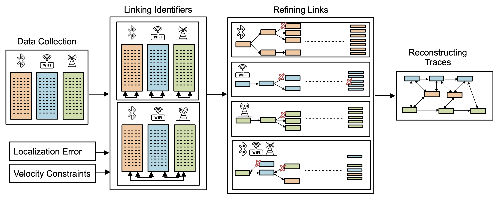

# CrossLink: Breaking Location Privacy by Linking Device Identifiers Across Protocols

This repository contains the artifact for **CrossLink**, a passive cross-protocol tracking framework that links temporary identifiers emitted by the same device over LTE, WiFi, and BLE. The artifact supports the simulation, tracing, reconstruction, and plotting pipeline used in the paper.

CrossLink models an adversary that receives identifier observations from distributed sniffers. Each observation contains a protocol identifier, timestamp, sniffer location, and an imprecise distance estimate. The backend constructs feasible inter-protocol and intra-protocol links under localization error and mobility constraints, refines those links using cross-protocol consistency, and reconstructs device traces to measure privacy leakage.



## Repository layout

```text
.
├── configs/                 # Scenario configuration files
├── data/                    # Generated traces, sniffer observations, and intermediate files
├── design/                  # Pipeline and architecture diagrams
├── output/                  # Reconstructed traces and generated plots
├── plot/                    # Plotting scripts for paper figures
├── reconstruction/          # Single- and multi-protocol trace reconstruction
├── scenario/                # SUMO scenario files
├── simulation/              # SUMO and synthetic graph mobility generation
├── tracing_algorithm/       # Aggregation, refinement, and filtering logic
├── rust_code/               # Rust implementation for sniffer-data, inter-map, and intra-map stages
├── main.py                  # Entry point for Python pipeline stages
└── pipeline.py              # Stage definitions used by main.py
```

A detailed stage diagram is available in `design/code_pipeline.pdf`.

## Requirements

### Hardware

The full 512-user experiments are memory intensive. We recommend:

- CPU: Intel Core i7 or comparable processor
- RAM: at least 16 GB; 32 GB recommended for larger scenarios
- Disk: at least 100 GB free space
- OS: tested on Ubuntu 22.04 LTS

### Software

- Python 3
- Poetry for Python dependency management
- Rust and Cargo for the optimized sniffer and mapping stages
- SUMO, if running the SUMO mobility pipeline

Install Python dependencies from the repository root:

```bash
pip3 install poetry (or sudo apt install python3-poetry)  
poetry --version #Tested with Poetry 1.8.2 version
poetry install # Installs the pyproject.toml dependencies
poetry shell # Activates the python shell
```

Alternatively, prefix Python commands with `poetry run` instead of entering a Poetry shell.

Build/check the Rust implementation from the directory that contains `Cargo.toml`:

```bash
curl --proto '=https' --tlsv1.2 -sSf https://sh.rustup.rs | sh # Installs Rustup and Rust Packages
# Perform source ~/.bashrc to load the cargo package path or open a new terminal to the cargo commands
cargo build --release # Installs dependencies
```

## Quick start

Run Python stages from the code directory that contains `main.py`. Run Rust stages from the directory that contains `Cargo.toml` (in many checkouts, this is the same directory).

```bash
cd code
CONFIG=scenario_result_512_sumo_all.yml
SCENARIO=$(basename "$CONFIG" .yml)
```

List available Python pipeline targets:

```bash
python3 main.py -c "$CONFIG" -t help
```

Clean previous outputs:

```bash
python3 main.py -c "$CONFIG" -t clean_all
```

Clean only Python cache files:

```bash
python3 main.py -c "$CONFIG" -t clean
```

## Running the pipeline

The artifact is organized as a sequence of stages. The same pattern applies to other scenario files: replace `scenario_result_512_sumo_all.yml` with the desired configuration and set `SCENARIO` to the filename without the `.yml` suffix.

We already provided the raw mobility traces in data folder, sumo can be ignored.

### 1. Generate mobility traces

For SUMO-based mobility:

```bash
python3 main.py -c "$CONFIG" -t sumo
python3 main.py -c "$CONFIG" -t filter_users_polygon
python3 main.py -c "$CONFIG" -t filter_users_RI_Count
```

This creates raw user mobility data under:

```text
data/<scenario_name>/raw_user_data_<scenario_name>.csv
```

The SUMO stage uses the scenario files in `scenario/` and parameters such as `POLYGON_COORDS`, `USER_TIMESTEPS`, and `mobility_factor` from the YAML configuration.

> Note: this stage can use substantial memory because the SUMO output is loaded and filtered in memory.

### 2. Generate protocol identifiers and transmissions
For LTE rotation mode use:   LTE_RANDOMIZATION_MODE: "handover" (cell change based inter-enodeB handover) or "time" (memoryless exponential mode)

```bash
python3 main.py -c "$CONFIG" -t generate_user_data
```

### 3. For Countermeasure of perfect mixing:

```bash
python3 main.py -c ""$CONFIG" -t generate_user_data_proximity
```

This converts mobility traces into per-device LTE, WiFi, and BLE identifier traces using the transmission and randomization parameters in the configuration. The main parameter groups are:

```text
BLUETOOTH_MIN_TRANSMIT, BLUETOOTH_MAX_TRANSMIT
WIFI_MIN_TRANSMIT,      WIFI_MAX_TRANSMIT
LTE_MIN_TRANSMIT,       LTE_MAX_TRANSMIT

BLUETOOTH_MIN_REFRESH,  BLUETOOTH_MAX_REFRESH
WIFI_MIN_REFRESH,       WIFI_MAX_REFRESH
LTE_MIN_REFRESH,        LTE_MAX_REFRESH

ENABLE_SYNCED_RANDOMIZATION
PROTOCOL_MIN_REFRESH,   PROTOCOL_MAX_REFRESH
ENABLE_USER_THRESHOLD,  TOTAL_NUMBER_OF_USERS
MAX_MOBILITY_FACTOR
DATA_USECASE
```

Expected output:

```text
data/<scenario_name>/user_data_<scenario_name>.csv
```

### 3. Generate sniffer observations with Rust

Before generating observations, choose sniffer locations. The repository includes example placement files in `sniffer_location/`, including full-coverage BLE/WiFi placements and partial-coverage placements. 


Configure protocol ranges and enabled protocols in the scenario file:

```text
BLUETOOTH_RANGE, WIFI_RANGE, LTE_RANGE
ENABLE_BLUETOOTH, ENABLE_WIFI, ENABLE_LTE
ENABLE_PARTIAL_COVERAGE
SNIFFER_PROCESSING_BATCH_SIZE
```

Generate sniffer observations using the Rust implementation:

```bash
cargo run --release -- "$SCENARIO" -- generate_sniffer_data
```
Generate sniffer observations for mobile sniffer scenario:

```bash
cargo run --release -- "$SCENARIO" -- generate_sniffer_data_from_end_devices 30
```

Expected output:

```text
data/<scenario_name>/sniffed_data_<scenario_name>.bin
```

### 4. Aggregate observations

```bash
python3 main.py -c "$CONFIG" -t aggregate_new
```

This groups observations into the format consumed by the tracing algorithm.

Expected outputs:

```text
data/<scenario_name>/aggregated_id_<scenario_name>.parquet
data/<scenario_name>/aggregated_users_<scenario_name>.parquet
```

### 5. Run CrossLink tracing

Set localization-error parameters in the scenario file:

```text
BLUETOOTH_LOCALIZATION_ERROR
WIFI_LOCALIZATION_ERROR
LTE_LOCALIZATION_ERROR
```

Construct the initial inter-protocol and intra-protocol maps using Rust:

```bash
cargo run --release --features inter_map_disable_trim -- "$SCENARIO" inter_map
cargo run --release --features intra_map_disable_trim -- "$SCENARIO" intra_map
```

The Rust stages construct candidate inter-protocol links and candidate intra-protocol links across identifier rotations. The Python stages convert these outputs, refine them using cross-protocol consistency, and filter ambiguous mappings.

Expected initial Rust outputs:

```text
data/<scenario_name>/intermap_<scenario_name>.pickle
data/<scenario_name>/intramap_<scenario_name>.pickle
```

Then run the Python conversion, refinement, and filtering stages:

```bash

python3 main.py -c "$CONFIG" -t refine_intramap
python3 main.py -c "$CONFIG" -t intra_filter
```
Expected refined outputs:

```text
data/<scenario_name>/refined_intermap_<scenario_name>.npy
data/<scenario_name>/filtered_intramap_<scenario_name>.npy
```

Expected single-protocol baseline output:

```text
data/<scenario_name>/filtered_intramap_single_<scenario_name>.npy
```

### 6. Reconstruct traces

```bash
python3 main.py -c "$CONFIG" -t reconstruction
```

This reconstructs user traces from the inferred mappings and prepares outputs for privacy-leakage analysis.

Expected outputs are written under:

```text
output/data/
```

Common output files include:

```text
output/data/baseline_<protocol>_<scenario_name>.csv
output/data/single_<protocol>_<scenario_name>.csv
output/data/multi_protocol_<scenario_name>.csv
```

### 7. Plot results

```bash
python3 main.py -c "$CONFIG" -t plot
```

Generated figures are written to:

```text
output/images/<scenario_name>/
```

For example:

```text
output/images/<scenario_name>/privacy_leakage_<scenario_name>.pdf
```

## Configuration guide

Each experiment is controlled by a YAML file. The scenario filename is also used to name the generated data directory and intermediate outputs.

Important configuration groups:

| Group | Parameters |
| --- | --- |
| Mobility | `POLYGON_COORDS`, `USER_TIMESTEPS`, `mobility_factor`, `MAX_MOBILITY_FACTOR` |
| User count | `ENABLE_USER_THRESHOLD`, `TOTAL_NUMBER_OF_USERS` |
| Enabled protocols | `ENABLE_BLUETOOTH`, `ENABLE_WIFI`, `ENABLE_LTE` |
| Transmission intervals | `*_MIN_TRANSMIT`, `*_MAX_TRANSMIT` |
| Identifier refresh intervals | `*_MIN_REFRESH`, `*_MAX_REFRESH` |
| Synchronized defense | `ENABLE_SYNCED_RANDOMIZATION`, `PROTOCOL_MIN_REFRESH`, `PROTOCOL_MAX_REFRESH` |
| Sniffer range | `BLUETOOTH_RANGE`, `WIFI_RANGE`, `LTE_RANGE` |
| Localization error | `BLUETOOTH_LOCALIZATION_ERROR`, `WIFI_LOCALIZATION_ERROR`, `LTE_LOCALIZATION_ERROR` |
| Coverage model | `ENABLE_PARTIAL_COVERAGE`, sniffer placement JSON files |

## Typical end-to-end command sequence

```bash
cd code
CONFIG=scenario_result_512_sumo_all.yml
SCENARIO=$(basename "$CONFIG" .yml)

# Python stages
python3 main.py -c "$CONFIG" -t clean_all
python3 main.py -c "$CONFIG" -t sumo
python3 main.py -c "$CONFIG" -t generate_user_data

# Rust sniffer-data stage
cargo run --release -- "$SCENARIO" generate_sniffer_data

# Python aggregation
python3 main.py -c "$CONFIG" -t aggregate_new

# Rust mapping stages
cargo run --release --features inter_map_disable_trim -- "$SCENARIO" inter_map
cargo run --release --features intra_map_disable_trim -- "$SCENARIO" intra_map

# Python refinement, reconstruction, and plotting

python3 main.py -c "$CONFIG" -t refine_intramap
python3 main.py -c "$CONFIG" -t intra_filter
python3 main.py -c "$CONFIG" -t reconstruction
python3 main.py -c "$CONFIG" -t plot
```
## Real World Device Validity:
The real world data are provided in two separate .csv files: lte_observations.csv and ble_observations.csb for 12 commodity devices. The anchors and ground truths are provided in anchors.csv and ground_truth.csv respectively.

```bash
cd real_world
python3 crosslink.py
```
Expected output: inter_links.csv and intra_links.csv

```bash
python3 evaluate.py
python3 plot_results.py
```

## Troubleshooting

- Run Python commands from the directory containing `main.py`; otherwise relative paths may not resolve.
- Run Cargo commands from the directory containing `Cargo.toml`; otherwise Cargo will not find the Rust crate.
- Rust stages expect the scenario name without the `.yml` suffix, for example `scenario_result_512_sumo_all`, not `scenario_result_512_sumo_all.yml`.
- Use `python3 main.py -c <config> -t help` to verify available Python stage names in the current checkout.
- If generated files are missing, check that the scenario name in the configuration matches the data directory name used by later stages.
- The SUMO stage is memory intensive. Reduce the number of users or timesteps for a small smoke test.
- If a stage fails after a previous run, use `clean_all` to remove stale intermediate files.
- If Poetry is not activated, run Python stages as `poetry run python3 main.py ...`.

## Research and ethics note

This artifact is intended for reproducible research on location-privacy risks in controlled simulations and lab-generated traces. Do not use it to collect data from, identify, or track third-party devices without authorization.
