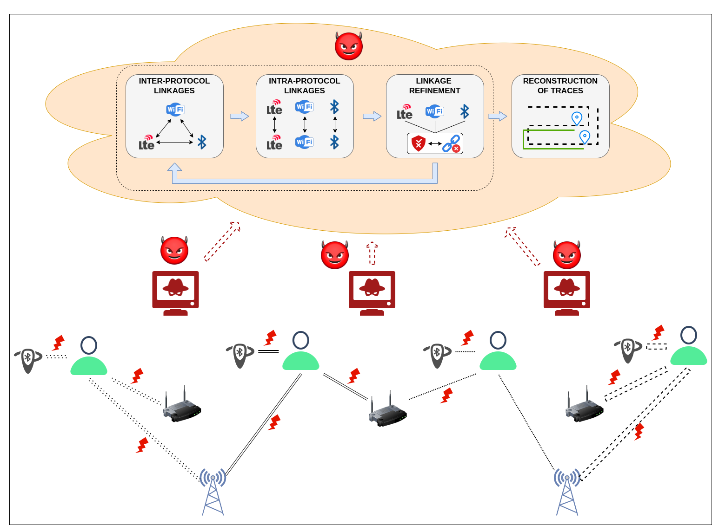

# CrossLink: Breaking Location Privacy by Linking Device Identifiers Across Protocols

This repository contains the artifact for **CrossLink**, a passive cross-protocol tracking framework that links temporary identifiers emitted by the same device over LTE, WiFi, and BLE. The artifact supports the simulation, tracing, reconstruction, and plotting pipeline used in the paper.

CrossLink models an adversary that receives identifier observations from distributed sniffers. Each observation contains a protocol identifier, timestamp, sniffer location, and an imprecise distance estimate. The backend then constructs feasible inter-protocol and intra-protocol links under localization error and mobility constraints, refines those links using cross-protocol consistency, and reconstructs device traces to measure privacy leakage.



## Repository layout

```text
.
├── configs/                 # Scenario configuration files
├── data/                    # Generated traces, sniffer observations, and intermediate files
├── design/                  # Pipeline and architecture diagrams
├── output/                  # Reconstructed traces and generated plots
├── plot/                    # Plotting scripts for paper figures
├── reconstruction/          # Single- and multi-protocol trace reconstruction
├── scenario/                # SUMO scenario files
├── simulation/              # SUMO and synthetic graph mobility generation
├── tracing_algorithm/       # Inter-map, intra-map, refinement, and filtering logic
├── main.py                  # Entry point for running pipeline stages
└── pipeline.py              # Stage definitions used by main.py
```

A detailed stage diagram is available in `design/code_pipeline.pdf`.

## Requirements

### Hardware

The full 512-user experiments are memory intensive. We recommend:

- CPU: Intel Core i7 or comparable processor
- RAM: at least 16 GB; 32 GB recommended for larger scenarios
- Disk: at least 100 GB free space
- OS: tested on Ubuntu 22.04 LTS

### Software

- Python 3
- Poetry for Python dependency management
- SUMO, if running the SUMO mobility pipeline
- Rust/Cargo, if running the optimized sniffer or mapping stages used by the artifact

Install Python dependencies from the repository root:

```bash
pip3 install poetry
poetry install
poetry shell
```

Alternatively, prefix commands with `poetry run` instead of entering a Poetry shell.

## Quick start

All pipeline commands should be run from the code directory that contains `main.py`.

```bash
cd code
CONFIG=scenario_result_512_sumo_all.yml
```

List available pipeline targets:

```bash
python3 main.py -c "$CONFIG" -t help
```

Clean previous outputs:

```bash
python3 main.py -c "$CONFIG" -t clean_all
```

Clean only Python cache files:

```bash
python3 main.py -c "$CONFIG" -t clean
```

## Running the pipeline

The artifact is organized as a sequence of stages. The same pattern applies to other scenario files: replace `scenario_result_512_sumo_all.yml` with the desired configuration.

### 1. Generate mobility traces

For SUMO-based mobility:

```bash
python3 main.py -c "$CONFIG" -t sumo
```

This creates raw user mobility data under:

```text
data/<scenario_name>/raw_user_data_<scenario_name>.csv
```

The SUMO stage uses the scenario files in `scenario/` and parameters such as `POLYGON_COORDS`, `USER_TIMESTEPS`, and `mobility_factor` from the YAML configuration.

> Note: this stage can use substantial memory because the SUMO output is loaded and filtered in memory.

### 2. Generate protocol identifiers and transmissions

```bash
python3 main.py -c "$CONFIG" -t generate_user_data
```

This converts mobility traces into per-device LTE, WiFi, and BLE identifier traces using the transmission and randomization parameters in the configuration. The main parameter groups are:

```text
BLUETOOTH_MIN_TRANSMIT, BLUETOOTH_MAX_TRANSMIT
WIFI_MIN_TRANSMIT,      WIFI_MAX_TRANSMIT
LTE_MIN_TRANSMIT,       LTE_MAX_TRANSMIT

BLUETOOTH_MIN_REFRESH,  BLUETOOTH_MAX_REFRESH
WIFI_MIN_REFRESH,       WIFI_MAX_REFRESH
LTE_MIN_REFRESH,        LTE_MAX_REFRESH

ENABLE_SYNCED_RANDOMIZATION
PROTOCOL_MIN_REFRESH,   PROTOCOL_MAX_REFRESH
ENABLE_USER_THRESHOLD,  TOTAL_NUMBER_OF_USERS
MAX_MOBILITY_FACTOR
DATA_USECASE
```

Expected output:

```text
data/<scenario_name>/user_data_<scenario_name>.csv
```

### 3. Generate sniffer observations

Before generating observations, choose sniffer locations. The repository includes example placement files in `data/`, including full-coverage BLE/WiFi placements and partial-coverage placements. New placements can be generated or modified through:

```bash
python3 services/sl_coordinates.py
```

Configure protocol ranges and enabled protocols in the scenario file:

```text
BLUETOOTH_RANGE, WIFI_RANGE, LTE_RANGE
ENABLE_BLUETOOTH, ENABLE_WIFI, ENABLE_LTE
ENABLE_PARTIAL_COVERAGE
SNIFFER_PROCESSING_BATCH_SIZE
```

Then run:

```bash
python3 main.py -c "$CONFIG" -t generate_sniffer_data
```

Expected output:

```text
data/<scenario_name>/sniffed_data_<scenario_name>.*
```

The exact extension depends on the selected implementation path.

### 4. Aggregate observations

```bash
python3 main.py -c "$CONFIG" -t aggregate
```

This groups observations into the format consumed by the tracing algorithm.

Expected outputs:

```text
data/<scenario_name>/aggregated_id_<scenario_name>.parquet
data/<scenario_name>/aggregated_users_<scenario_name>.parquet
```

### 5. Run CrossLink tracing

Set localization-error parameters in the scenario file:

```text
BLUETOOTH_LOCALIZATION_ERROR
WIFI_LOCALIZATION_ERROR
LTE_LOCALIZATION_ERROR
```

Then run the tracing stages:

```bash
python3 main.py -c "$CONFIG" -t intermap_new
python3 main.py -c "$CONFIG" -t intramap_new
python3 main.py -c "$CONFIG" -t generate_mappings
python3 main.py -c "$CONFIG" -t refine_intramap
python3 main.py -c "$CONFIG" -t intra_filter
```

These stages construct candidate inter-protocol links, construct candidate intra-protocol links across identifier rotations, refine both sets using cross-protocol consistency, and filter ambiguous intra-protocol mappings.

Expected multi-protocol outputs:

```text
data/<scenario_name>/refined_intermap_<scenario_name>.npy
data/<scenario_name>/filtered_intramap_<scenario_name>.npy
```

Expected single-protocol baseline output:

```text
data/<scenario_name>/filtered_intramap_single_<scenario_name>.npy
```

### 6. Reconstruct traces

```bash
python3 main.py -c "$CONFIG" -t reconstruction
```

This reconstructs user traces from the inferred mappings and prepares outputs for privacy-leakage analysis.

Expected outputs are written under:

```text
output/data/
```

Common output files include:

```text
output/data/baseline_<protocol>_<scenario_name>.csv
output/data/single_<protocol>_<scenario_name>.csv
output/data/multi_protocol_<scenario_name>.csv
```

### 7. Plot results

```bash
python3 main.py -c "$CONFIG" -t plot
```

Generated figures are written to:

```text
output/images/<scenario_name>/
```

For example:

```text
output/images/<scenario_name>/privacy_leakage_<scenario_name>.pdf
```

## Configuration guide

Each experiment is controlled by a YAML file. The scenario filename is also used to name the generated data directory and intermediate outputs.

Important configuration groups:

| Group | Parameters |
| --- | --- |
| Mobility | `POLYGON_COORDS`, `USER_TIMESTEPS`, `mobility_factor`, `MAX_MOBILITY_FACTOR` |
| User count | `ENABLE_USER_THRESHOLD`, `TOTAL_NUMBER_OF_USERS` |
| Enabled protocols | `ENABLE_BLUETOOTH`, `ENABLE_WIFI`, `ENABLE_LTE` |
| Transmission intervals | `*_MIN_TRANSMIT`, `*_MAX_TRANSMIT` |
| Identifier refresh intervals | `*_MIN_REFRESH`, `*_MAX_REFRESH` |
| Synchronized defense | `ENABLE_SYNCED_RANDOMIZATION`, `PROTOCOL_MIN_REFRESH`, `PROTOCOL_MAX_REFRESH` |
| Sniffer range | `BLUETOOTH_RANGE`, `WIFI_RANGE`, `LTE_RANGE` |
| Localization error | `BLUETOOTH_LOCALIZATION_ERROR`, `WIFI_LOCALIZATION_ERROR`, `LTE_LOCALIZATION_ERROR` |
| Coverage model | `ENABLE_PARTIAL_COVERAGE`, sniffer placement JSON files |

## Typical end-to-end command sequence

```bash
cd code
CONFIG=scenario_result_512_sumo_all.yml

python3 main.py -c "$CONFIG" -t clean_all
python3 main.py -c "$CONFIG" -t sumo
python3 main.py -c "$CONFIG" -t generate_user_data
python3 main.py -c "$CONFIG" -t generate_sniffer_data
python3 main.py -c "$CONFIG" -t aggregate
python3 main.py -c "$CONFIG" -t intermap_new
python3 main.py -c "$CONFIG" -t intramap_new
python3 main.py -c "$CONFIG" -t generate_mappings
python3 main.py -c "$CONFIG" -t refine_intramap
python3 main.py -c "$CONFIG" -t intra_filter
python3 main.py -c "$CONFIG" -t reconstruction
python3 main.py -c "$CONFIG" -t plot
```

## Troubleshooting

- Run commands from the directory containing `main.py`; otherwise relative paths may not resolve.
- Use `python3 main.py -c <config> -t help` to verify available stage names in the current checkout.
- If generated files are missing, check that the scenario name in the configuration matches the data directory name used by later stages.
- The SUMO stage is memory intensive. Reduce the number of users or timesteps for a small smoke test.
- If a stage fails after a previous run, use `clean_all` to remove stale intermediate files.
- If Poetry is not activated, run commands as `poetry run python3 main.py ...`.

## Research and ethics note

This artifact is intended for reproducible research on location-privacy risks in controlled simulations and lab-generated traces. Do not use it to collect data from, identify, or track third-party devices without authorization.
